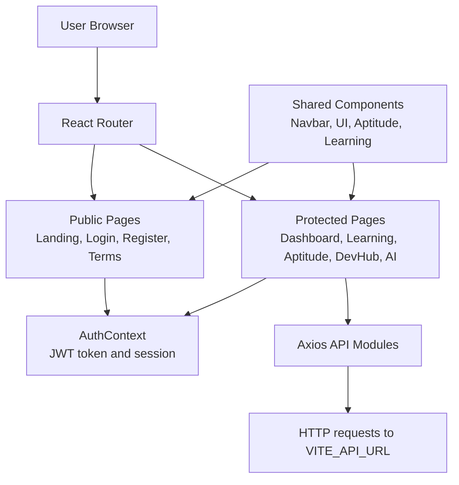
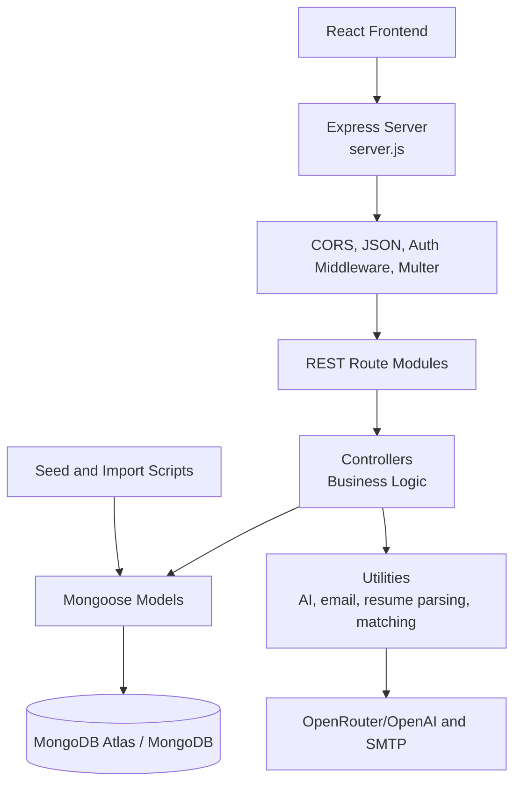
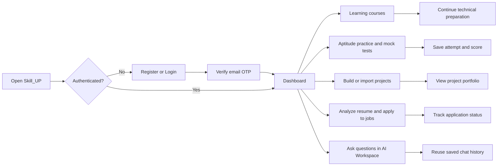

# Skill_UP

Skill_UP is a full-stack career preparation platform for B.Tech students. It brings aptitude practice, technical learning, project showcasing, job support, AI assistance, and progress tracking into one application.

The project is split into two independently runnable applications:

- `frontend`: React and Vite user interface
- `backend`: Node.js and Express REST API with MongoDB persistence

## Live Demo

- Frontend: [https://skill-up-frontend.onrender.com](https://skill-up-frontend.onrender.com/)
- Backend health check: open the deployed backend root URL if one is configured; it should return `Skill_UP Backend Running`.

## Project Overview: How To Check It Quickly

1. Open the live frontend or run both applications locally.
2. Register a new account and verify the email OTP.
3. Log in to reach the protected student experience.
4. Open the dashboard to see aptitude, jobs, and project activity.
5. Use Learning to browse courses and open a course detail page.
6. Use Aptitude to practice Quantitative, Logical, Verbal, or Technical topics and submit a mock test.
7. Open DevHub to create, import, edit, view, and delete projects.
8. Open AI Workspace to create chats and ask questions.
9. Upload a PDF or DOC/DOCX resume in AI Job Recommendations to receive role and job suggestions.
10. Browse jobs, apply to a job, and track application status from the dashboard.

> Most learning, aptitude, dashboard, DevHub, and chat screens require authentication. Resume analysis is available through the job analysis endpoint and uses the configured AI provider when enabled.

## Main Features

- JWT-based registration, login, email OTP verification, and password reset
- Protected routes and persistent client-side authentication state
- Aptitude practice by category and topic
- Full mock tests with score and attempt tracking
- Curated learning courses with category and slug-based detail pages
- DevHub for creating, importing, updating, viewing, and deleting projects
- Job browsing, applications, and application status tracking
- Resume parsing and AI-powered job recommendations
- AI Workspace with saved conversations and chat history
- Dashboard summaries for aptitude, jobs, and projects
- Excel question import support for aptitude content
- Seed scripts for aptitude questions, courses, and jobs

## Technology Stack

| Layer | Technologies |
| --- | --- |
| Frontend | React 19, Vite, React Router, Axios, Tailwind CSS, Lucide React, React Context API |
| Backend | Node.js, Express 5, CommonJS, REST APIs, CORS, Multer |
| Database | MongoDB with Mongoose |
| Authentication | JWT and bcryptjs |
| AI | OpenRouter/OpenAI-compatible API, resume parsing with `pdf-parse` and `mammoth` |
| Email | Nodemailer for OTP and account email workflows |
| Content import | `xlsx` seed/import utilities |
| Deployment | Render frontend and backend services, MongoDB Atlas |

## Frontend Architecture

The frontend is a Vite-powered React single-page application. `App.jsx` defines route composition and protected/guest access rules. Pages call small API modules, while shared authentication and UI state live in context and components.



### Frontend request flow

1. A user opens a page or submits an action.
2. The relevant page calls an API module in `frontend/src/api`.
3. Axios sends the request to `VITE_API_URL`.
4. The backend returns JSON data or an error response.
5. React updates the page and local authentication state.

## Backend Architecture

The backend follows a route-controller-model structure with shared middleware and utility modules.



### API module map

| Base path | Responsibility |
| --- | --- |
| `/api/auth` | Registration, login, verification, password recovery |
| `/api/projects` | Authenticated project CRUD and GitHub project import |
| `/api/ai` | AI question and response workflow |
| `/api/aptitude` | Questions, topic filtering, and saved attempts |
| `/api/courses` | Course listing, category filtering, details, and creation |
| `/api/jobs` | Resume analysis, job applications, and status updates |
| `/api/dashboard` | Combined aptitude, job, and project summaries |
| `/api/chat` | AI chat creation, history, messages, and deletion |
| `/api/excel` | Aptitude question upload/import |

## Application Flow



## Screens and Expected Output

The current repository does not include committed screenshot files, so this table documents the main screens and the output a reviewer should see while checking the live application.

| Screen | How to reach it | Expected output |
| --- | --- | --- |
| Landing page | `/` | Product introduction and entry points for account access |
| Register and verification | `/register`, `/verify-otp` | Account form, OTP verification, and validation messages |
| Login | `/login` | Successful login redirects to the protected app experience |
| Dashboard | `/dashboard` | Aptitude, jobs, and project summary data for the signed-in user |
| Learning | `/learning` | Course list with category or topic navigation |
| Learning detail | `/learning/:courseId` | Course syllabus, lessons, and technical content |
| Aptitude | `/aptitude/quantitative`, `/logical`, `/verbal`, `/technical` | Topic lists and practice questions |
| Mock test | `/aptitude/mock` | Timed or full question flow with submitted result |
| DevHub | `/DevHub` | Project cards, project creation/import, and project management actions |
| AI Workspace | `/ai-workspace` | Chat creation, AI responses, and saved conversation history |
| Job recommendations | `/ai-job-recommendations` | Resume upload, extracted skills, detected role, and matching jobs |
| Profile and terms | `/profile`, `/terms-and-conditions` | User profile information and legal content |

To add visual captures later, place them in `docs/screenshots/` and link them from this section. Do not commit secrets or personal resume data with screenshots.

## Repository Structure

```text
Skill_UP/
├── README.md
├── .gitignore
├── backend/
│   ├── config/              # Database connection
│   ├── controllers/         # Request and business logic
│   ├── middleware/          # Auth and upload middleware
│   ├── models/              # Mongoose schemas
│   ├── routes/              # REST route definitions
│   ├── seeds/               # Courses, questions, and jobs import data
│   ├── uploads/             # Runtime upload directory
│   ├── utils/               # AI, email, parsing, matching helpers
│   ├── package.json
│   └── server.js            # Express entry point
└── frontend/
    ├── public/              # Static assets
    ├── src/
    │   ├── api/             # Axios API clients
    │   ├── assets/          # Frontend assets
    │   ├── components/      # Shared and feature components
    │   ├── context/         # Auth context
    │   ├── data/            # Local learning/course data
    │   ├── hooks/            # Reusable React hooks
    │   ├── pages/            # Route-level screens
    │   ├── utils/            # Frontend helpers
    │   ├── App.jsx          # Routes and guards
    │   └── main.jsx         # React entry point
    ├── package.json
    └── vite.config.js
```

## Installation and Local Setup

### Prerequisites

- Node.js 18 or newer
- npm
- MongoDB Atlas database or local MongoDB instance
- SMTP credentials for email verification and password recovery
- OpenRouter or OpenAI-compatible API key for AI features

### 1. Clone the repository

```bash
git clone https://github.com/Hks100524/Skill_UP.git
cd Skill_UP
```

### 2. Install backend dependencies

```bash
cd backend
npm install
```

Create `backend/.env`:

```env
PORT=5000
MONGO_URI=your_mongodb_connection_string
JWT_SECRET=your_long_random_jwt_secret
EMAIL_USER=your_email_address
EMAIL_PASS=your_email_password_or_app_password
OPENROUTER_API_KEY=your_openrouter_key
OPENROUTER_MODEL=openai/gpt-4o-mini
APP_URL=http://localhost:5173
```

`OPENAI_API_KEY` can be used instead of `OPENROUTER_API_KEY` when supported by the configured AI client. Keep `.env` private and never commit it.

### 3. Start the backend

```bash
npm run dev
```

The API runs at `http://localhost:5000`. A production-style start is available with `npm start`.

### 4. Install and configure the frontend

Open a second terminal from the repository root:

```bash
cd frontend
npm install
```

Create `frontend/.env`:

```env
VITE_API_URL=http://localhost:5000
```

Start the frontend:

```bash
npm run dev
```

Open the Vite URL shown in the terminal, usually `http://localhost:5173`.

### 5. Optional content seeding

Run these from `backend/` after configuring `MONGO_URI`:

```bash
npm run seed:aptitude
npm run seed:learning
npm run seed:jobs
```

### Useful checks

```bash
# frontend production build
cd frontend
npm run build

# frontend lint
npm run lint
```

## Challenges and Solutions

| Challenge | Solution used |
| --- | --- |
| Keeping student preparation tools in one product | Separate feature modules and route groups for learning, aptitude, jobs, DevHub, dashboard, and AI |
| Protecting personal progress and projects | JWT authentication with protected frontend routes and backend auth middleware |
| Handling multiple content formats | Mongoose models plus seed/import scripts for courses, questions, and jobs |
| Turning a resume into useful job matches | PDF/DOCX parsing, skill extraction, role detection, experience detection, and matching utilities |
| Supporting AI without coupling the UI to one provider | OpenAI-compatible client configuration with OpenRouter model selection through environment variables |
| Upload validation and resource limits | Multer memory storage with PDF/DOC/DOCX validation and a 10 MB file-size limit |
| Showing useful progress in one place | Dashboard endpoints aggregate aptitude, jobs, and project information |
| Keeping development and deployment configurable | Frontend API base URL and backend secrets are controlled through environment variables |

## Future Scope

- Admin panel for managing users, courses, aptitude questions, jobs, and reports
- More detailed analytics for topic-wise strengths, weaknesses, and learning streaks
- AI mock interviews with feedback and follow-up questions
- Personalized learning paths based on aptitude scores and resume skills
- Real-time notifications for job updates, chat activity, and course reminders
- Cloud object storage for project images and resume files
- Role-based permissions for students, recruiters, and administrators
- Automated tests, API documentation, and CI checks for every pull request
- Better production observability, rate limiting, and centralized error reporting

## Author

**Harshit Kumar Sharma**

- GitHub: [Hks100524](https://github.com/Hks100524)

## License

This project is developed for educational and portfolio purposes.

